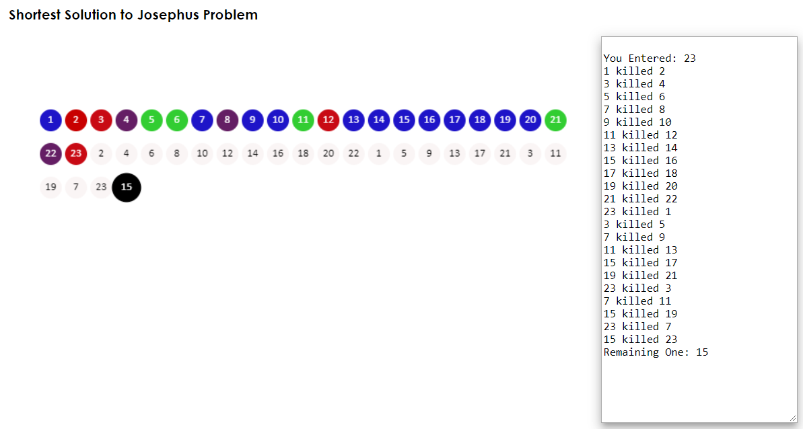

## Solution to Josephus problem

### This is all that there is:
```
//No. of people
var N = prompt("Enter # of people","");
var k = 1; //order progression - everyone kills the next guy
var m; // counter

//push 'everyone' in an array
for(let i=1; i<=N; i++){
	people.push(i);
}

//iterate over the array & 'kill' every alternate one and pass on the 'sword'
do {
    for(let j=0;j<people.length;j++){
		m = (j+k);

        //if you reach end of the array, start again
		if(m>=people.length){
			m=0;
		}

		//see who is killing whom
        console.log(people[j]+" killed "+people[m]);
		
        //kill!!
        people.splice(m, 1);
		}
} while (people.length > 1);

//and the winner is...
alert("Remaining One: "+people);

```

### Here is how it looks with all other decorative stuff - (see code for implementation)
+ Large black dot is survivor
+ White dots are people in the order they are killed
+ Colorful dots are, well, when they were all alive & happy!



### License

This project is licensed as **As Is** without any Warranty. Refer to MIT or Apache's OS license for details whichever one you like.

```
        codecodecodeco
       codecodec   
      codecode  
     codecode         
     codecod          
     codecod         
     codecode      
      codecodec
       sanjeevpan 
          deycodeco
            codecodecode
```


